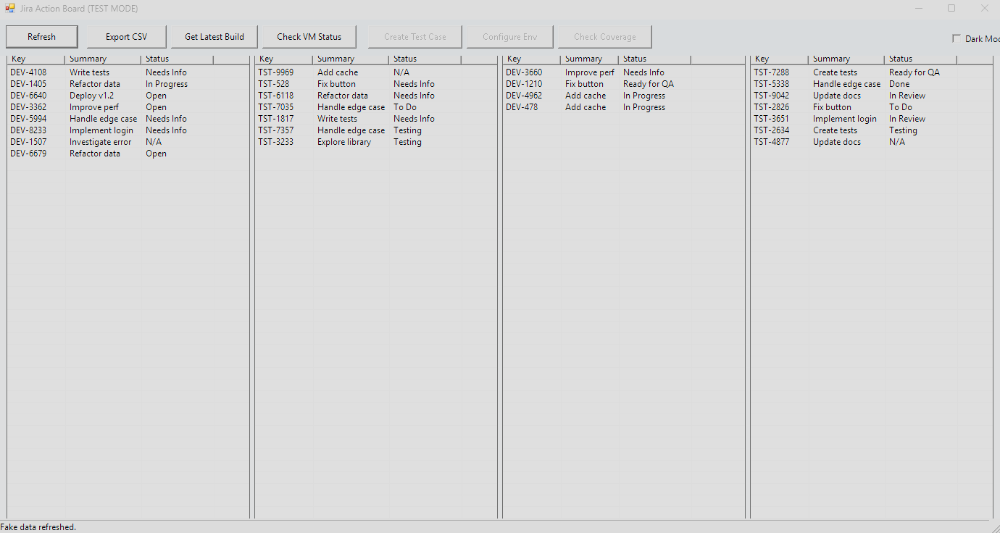

# Jira Action Board GUI (JiraWorkflowUI)

## Synopsis

A PowerShell GUI application designed to display actionable Jira tickets retrieved via the Jira API, featuring action buttons and a theme toggle.

## Description

This project provides a graphical user interface built with PowerShell and Windows Forms to visualize Jira issues relevant to a user's workflow. It utilizes a helper module (`JiraApiHelper.psm1`) to handle the connection and data retrieval from a Jira instance, configured through a `config.json` file.

The main script (`JiraActionBoard.ps1`) sets up the UI, which displays tickets in multiple, customizable columns (e.g., "DEV: Needs Action?", "Needs Review / Blocked?"). It includes general action buttons (like Refresh) and contextual buttons that become active when a ticket is selected. The UI also features a Dark Mode toggle for visual preference.

A `-TestMode` switch allows running the application with generated fake data, bypassing the need for a live Jira connection or configuration, useful for UI development or demonstration.



## Features

* **Graphical User Interface:** Provides a visual board using Windows Forms.
* **Jira Integration:** Connects to a Jira instance via its REST API (using `JiraApiHelper.psm1`).
* **Configurable:** Jira connection details (URL, email, API token) and project keys are managed in `config.json`.
* **Customizable Columns:** The JQL queries defining the issues shown in each column are located within the `Refresh-Data` function in `JiraActionBoard.ps1` and can be modified.
* **Action Buttons:** Includes general buttons (Refresh) and contextual buttons (enabled on item selection).
* **Dark/Light Theme:** Allows toggling between visual themes.
* **Test Mode:** Can run with `-TestMode` to use fake data without needing Jira configuration.
* **Double-Click Action:** Opens the selected Jira issue in the default web browser.

## Files

* **`JiraActionBoard.ps1`:** The main PowerShell script that creates and runs the GUI application.
* **`JiraApiHelper.psm1`:** A PowerShell module containing functions to load configuration (`Load-Config`) and fetch Jira issues using JQL (`Get-JiraIssues`).
* **`config.json`:** Configuration file to store Jira connection details (URL, Email, API Token) and project keys used in JQL queries. **Do not commit sensitive information like API tokens to public repositories.**

## Requirements

* PowerShell Version 5.1 or later.
* Windows Operating System (due to Windows Forms dependency).
* .NET Framework (usually included with Windows).

## Setup

1.  Ensure all three files (`JiraActionBoard.ps1`, `JiraApiHelper.psm1`, `config.json`) are located in the same directory.
2.  **Configure `config.json`:**
    * Replace `"https://your-domain.atlassian.net"` with your actual Jira instance URL.
    * Replace `"YOUR_JIRA_API_TOKEN"` with a valid Jira API token generated from your account settings. (See [Atlassian documentation](https://support.atlassian.com/atlassian-account/docs/manage-api-tokens-for-your-atlassian-account/)).
    * Replace `"your.email@example.com"` with the email address associated with your Jira account.
    * Update `"DevProjectKey"`, `"TstProjectKey"`, and `"Username"` as needed for your JQL queries.
3.  **(Optional) Customize JQL:** Modify the JQL queries within the `Refresh-Data` function in `JiraActionBoard.ps1` to define the issues displayed in each column according to your specific workflow needs.

## Usage

* **Standard Mode:** Open PowerShell, navigate to the directory containing the files, and run:
    ```powershell
    .\JiraActionBoard.ps1
    ```
* **Test Mode (No Jira Connection):** Run the script with the `-TestMode` switch:
    ```powershell
    .\JiraActionBoard.ps1 -TestMode
    ```
    This will populate the board with randomly generated fake data.

## Notes

* The application relies on the `JiraApiHelper.psm1` module being present in the same directory.
* Error handling for API calls and configuration loading is included, often displaying pop-up messages for critical errors.
* Ensure your Jira API token has the necessary permissions to execute the JQL queries defined in the script.
